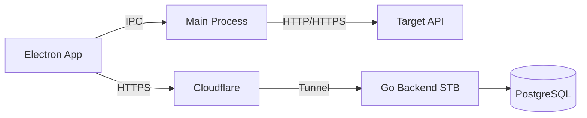
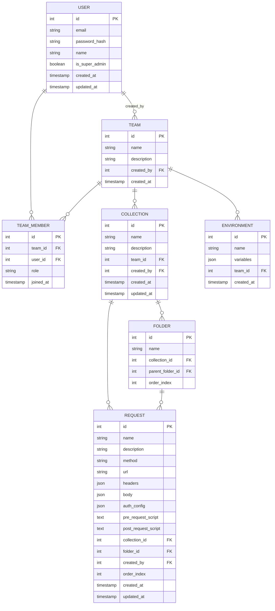

# Wapbolt — Product Requirements Document (PRD)

**Versi:** 1.4  
**Status:** Draft  
**Terakhir Diperbarui:** April 2026  
**Author:** Waluyo Ade Prasetio

---

# Overview

**Wapbolt** adalah desktop application untuk pengujian, kolaborasi, dan dokumentasi API — alternatif Postman yang dirancang untuk tim developer dan QA.

Dibangun sebagai **Electron desktop app** (macOS + Windows), bebas CORS karena request dikirim dari Electron Main Process. Backend **Go single binary** berjalan di STB Android Waluyo (via Cloudflare), dan kelak bisa diinstall **on-premise di server client** tanpa perubahan kode.

**Tahap saat ini:** Internal tim Waluyo — tidak ada license server dulu.  
**Tahap berikutnya:** Jual ke client luar dengan model on-premise license (license server ditambahkan nanti, tidak mengubah kode existing).

---

# Nama & Branding

| Atribut | Detail |
|---|---|
| **Nama Produk** | Wapbolt |
| **Asal Nama** | Inisial **W**aluyo **A**de **P**rasetio + suffix *-ify* |
| **Tagline** | *"API Testing, Built for Teams"* |
| **Domain** | wapbolt.io / wapbolt.dev |
| **Backend URL (internal)** | api.wapbolt.io (via Cloudflare Tunnel → STB Android) |
| **Logo** | Wordmark dengan huruf **W** sebagai ikon utama |

---

# Infrastruktur Saat Ini

```
Tim (mana saja, internet)
        │
        ▼
┌───────────────────┐
│  Cloudflare       │  ← HTTPS otomatis, DDoS protection, IP rumah tersembunyi
│  api.wapbolt.io    │
└────────┬──────────┘
         │ Cloudflare Tunnel
         ▼
┌───────────────────┐
│  STB Android      │  ← Di rumah Waluyo
│  Go Backend       │
│  + PostgreSQL     │
└───────────────────┘
```

**Keuntungan Cloudflare:**
- HTTPS gratis tanpa urus SSL certificate
- IP rumah Waluyo tidak terekspos ke internet
- Bisa diakses tim dari mana saja selama ada internet

---

# Model Akses & Tim

## Super Admin (Waluyo)

Waluyo memiliki akses `is_super_admin = true` di database:
- Bisa lihat dan masuk ke **semua tim** tanpa perlu diundang
- Bisa buat tim baru
- Bisa suspend / hapus akun anggota manapun
- Bisa reset password anggota
- Tidak ada fitur self-register — **semua akun dibuat oleh Waluyo**

## Struktur Tim

```
Waluyo (Super Admin)
├── Tim A — Backend Team
│   ├── Budi (Editor)
│   ├── Siti (Viewer)
│   └── Koleksi: "Payment API", "User API"
│
├── Tim B — Mobile Team
│   ├── Andi (Editor)
│   ├── Rina (Admin)
│   └── Koleksi: "Mobile API", "Push Notif"
│
└── Tim C — QA Team
    ├── Dodi (Viewer)
    └── Koleksi: "Regression Suite"
```

- Koleksi Tim A **tidak terlihat** oleh Tim B kecuali dibagikan eksplisit
- Setiap tim bisa punya environment variables sendiri

## Role Per Tim

| Role | Hak Akses |
|---|---|
| **Owner** | Semua + delete tim + manage member |
| **Admin** | Invite/remove member, manage collections & environments |
| **Editor** | Buat, edit, delete request & collection |
| **Viewer** | Lihat dan kirim request, tidak bisa edit |

---

# Roadmap Besar

```
Sekarang (Fase 1-2)     →   3-6 bulan (Fase 3-4)    →   6-12 bulan (Fase 5+)
────────────────────        ──────────────────────        ──────────────────────
Internal tim Waluyo         Tambah fitur lanjutan         Jual ke client luar
STB Android +               kolaborasi real-time,         On-premise license
Cloudflare                  versioning, mock server,      (license server
                            CI/CD integration             ditambahkan)

Satu codebase yang sama sepanjang waktu ✅
Go binary = tinggal install di server client manapun
```

---

# Fitur — MVP Internal (Prioritas Minggu Ini)

## Yang Harus Ada

### Auth & User Management
- Login dengan email + password (JWT + Refresh Token)
- **Tidak ada self-register** — akun dibuat Waluyo via admin CLI atau panel
- Super admin: Waluyo bisa akses semua tim
- Reset password oleh Waluyo untuk anggota

### Manajemen Tim
- Waluyo buat tim baru
- Waluyo assign anggota ke tim dengan role tertentu
- Waluyo bisa ubah role atau hapus anggota dari tim
- Notifikasi email undangan ke anggota (via Resend)

### Koleksi & Request
- CRUD Collection dengan folder hierarki
- CRUD Request: method, URL, headers, body (JSON/Form/Raw), params
- Import koleksi Postman v2.1 JSON
- Environment variables per tim dengan interpolasi `{{variable_name}}`
- **Scripting Engine (Wapbolt SDK)**: Dukungan Pre-request dan Post-request (Tests) script menggunakan JavaScript.
  - Global object: `wap` (alias `pm` untuk kompatibilitas).
  - Library terintegrasi: `moment` dan `lodash`.
  - Akses environment: `wap.setEnv()`, `wap.getEnv()`.
- Koleksi ter-share otomatis ke semua anggota tim sesuai role

### Kirim Request (Bebas CORS)
- Request dikirim via Electron Main Process → tidak kena CORS
- Response viewer: status code, body (JSON pretty-print), headers, waktu
- Authentication: Basic Auth, Bearer Token, API Key

### Auth Request
- Basic Auth, Bearer Token, API Key
- Simpan credential di OS keychain (keytar)

## Yang Ditunda (Fase Berikutnya)

- Real-time collaboration & field-level locking
- Versioning & rollback
- Mock server
- Automated testing & CI/CD
- OAuth 2.0
- API documentation generator
- License server (untuk penjualan on-premise)

---

# User Flow — MVP

1. **Waluyo buat akun** untuk anggota tim via admin panel / CLI
2. **Anggota terima email** berisi kredensial login (via Resend)
3. **Anggota download** installer Wapbolt (.dmg / .exe) dari link yang dibagikan
4. **Anggota login** dengan kredensial yang diterima
5. **Anggota lihat tim mereka** dan koleksi yang tersedia
6. **Anggota import koleksi Postman** atau buat request baru
7. **Anggota kirim request** — bebas CORS, response langsung tampil
8. **Waluyo pantau** dari super admin view: siapa di tim mana, koleksi apa

---

# Arsitektur

## Sistem Saat Ini

```
┌──────────────────────────────────────────┐
│  Electron Desktop App (macOS / Windows)  │
│                                          │
│  ┌─────────────────────────────────────┐ │
│  │  React UI (Renderer Process)        │ │
│  └──────────────┬──────────────────────┘ │
│                 │ IPC                    │
│  ┌──────────────▼──────────────────────┐ │
│  │  Electron Main Process              │ │
│  │  - HTTP Executor (bebas CORS)       │ │──► Target API (API manapun)
│  │  - keytar (OS keychain)             │ │
│  └──────────────┬──────────────────────┘ │
│                 │ HTTPS                  │
└─────────────────┼────────────────────────┘
                  │
         ┌────────▼────────┐
         │   Cloudflare    │
         │  api.wapbolt.io  │
         └────────┬────────┘
                  │ Tunnel
         ┌────────▼────────┐
         │  STB Android    │
         │  Go + Fiber     │
         │  PostgreSQL     │
         └─────────────────┘
```

## Arsitektur On-Premise (Secure & Offline-First)

```
Client Tim Luar                          Server Client (On-Premise)
┌─────────────────┐                      ┌──────────────────────────┐
│  Electron App   │─── HTTPS ───────────►│  Go Binary (Locked)      │
└─────────────────┘                      │  - Embedded Public Key   │
                                         │  - Offline Validation    │
                                         └──────────────────────────┘
```

**Mekanisme Lisensi:**
- **Offline Validation:** Verifikasi integritas lisensi menggunakan algoritma Ed25519 secara lokal tanpa memerlukan koneksi internet ke server pusat.
- **Grace Period:** Memberikan masa tenggang 24 jam setelah lisensi expired sebelum aplikasi terkunci sepenuhnya.
- **Binary Locking:** Public Key ditanamkan saat proses kompilasi menggunakan `-ldflags`.




---

# Database Schema



**Catatan penting:**
- `USER.is_super_admin` — jika `true`, bisa akses semua tim tanpa jadi TEAM_MEMBER
- Tidak ada tabel registrasi/invite token — akun dibuat langsung oleh Waluyo
- Tabel untuk fitur lanjutan (FIELD_LOCK, COLLECTION_VERSION, COMMENT, MOCK_SERVER) ditambahkan di fase berikutnya via migration

---

# Tech Stack

## Desktop (Electron + React)

| Teknologi | Pilihan |
|---|---|
| Framework | **Electron** |
| UI | **React + Zustand + Radix UI + Tailwind CSS** |
| Code Editor | **Monaco Editor** (untuk request body & scripts) |
| Scripting Libraries | **Moment.js, Lodash** |
| HTTP Executor | **Electron Main Process** (bebas CORS) |
| Credential Storage | **keytar** (OS keychain) |
| Packaging | **electron-builder** (.dmg + .exe) |
| Auto Update | **electron-updater** |

## Backend (Go — STB Android)

| Teknologi | Pilihan |
|---|---|
| Language | **Go** |
| Framework | **Fiber** |
| ORM | **GORM** |
| Database | **PostgreSQL** |
| Auth | **JWT + Refresh Token Rotation** |
| Migrations | **golang-migrate** |
| Logging | **zerolog** |
| Email | **Resend** (resend-go SDK) |
| Compile target saat ini | `GOARCH=arm64 GOOS=linux` (STB Android) |
| Compile target on-premise | `linux/amd64`, `linux/arm64`, `windows/amd64`, `darwin/arm64` |

## Infrastruktur

| Komponen | Detail |
|---|---|
| Hosting backend | STB Android di rumah Waluyo |
| Akses publik | Cloudflare Tunnel → `api.wapbolt.io` |
| HTTPS | Otomatis via Cloudflare |
| Database | PostgreSQL di STB Android |

---

# Technical Constraints & Guidelines

- **CORS:** Request ke target API wajib dari Electron Main Process, bukan Renderer.
- **No Self-Register:** Endpoint register tidak ada di API publik. Akun dibuat via admin CLI command: `wapbolt-admin create-user --email --name --team --role`
- **Super Admin:** Field `is_super_admin` di tabel USER. Jika `true`, middleware skip pengecekan TEAM_MEMBER dan izinkan akses ke semua resource.
- **Cloudflare:** Backend hanya terima koneksi dari Cloudflare (bind ke `localhost`, tidak expose port langsung ke internet).
- **Email:** Semua via Resend. `RESEND_API_KEY` di environment variable, tidak di kode.
- **Migrations:** Wajib via golang-migrate. Tidak perubahan schema manual.
- **API Prefix:** Semua endpoint `/api/v1/`.
- **Error Format:** `{ "error": "string", "code": "string", "details": {} }`.
- **Logging:** zerolog, structured. Jangan log password, token, atau credential.
- **On-Premise Ready:** Binary Go harus bisa dikompilasi untuk berbagai platform tanpa perubahan kode. Konfigurasi via environment variable (`.env`), bukan hardcode.
- **Future License:** Saat nanti ditambahkan license server, cukup tambahkan middleware validasi license di startup backend. Tidak perlu ubah business logic yang sudah ada.