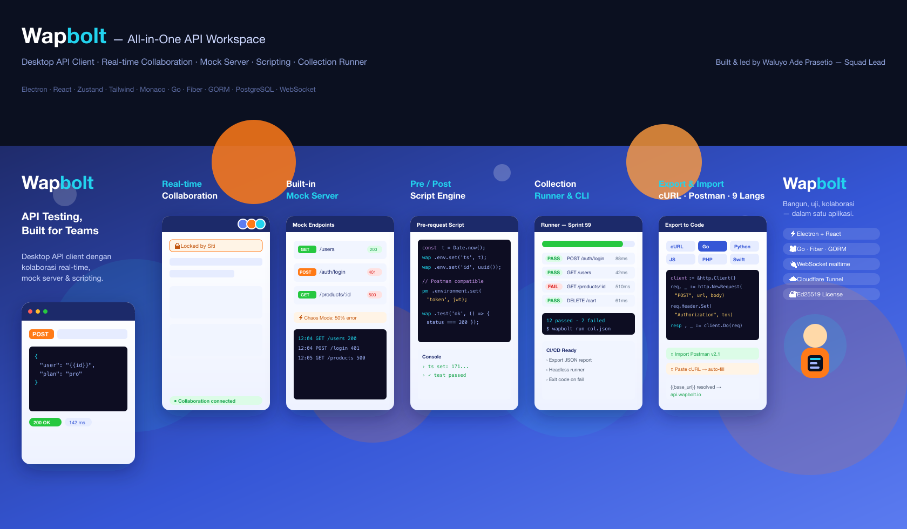

# Wapbolt — Portfolio Description (ID / EN)

---

## 🇮🇩 Bahasa Indonesia

### Ringkasan
**Wapbolt** adalah aplikasi desktop *all-in-one* untuk pengujian API, kolaborasi tim, dan dokumentasi — sebuah alternatif Postman yang saya rancang dan pimpin pengembangannya dari nol. Dibangun dengan **Electron + React** di sisi klien dan **Go (Fiber)** di sisi backend, Wapbolt dipakai aktif oleh tim Backend dan QA internal untuk alur kerja pengujian API harian.

### Peran Saya — Squad Lead
Sebagai **Squad Lead**, saya bertanggung jawab atas keseluruhan arah teknis dan eksekusi produk:
- Menentukan arsitektur (monorepo: desktop, landing page, backend, license server).
- Memimpin dan mereview pekerjaan tim, menetapkan standar kode & alur kerja Git.
- Merancang sistem inti: collaboration engine, scripting sandbox, dan sistem lisensi offline-first.
- Mengelola roadmap, breakdown sprint, dan delivery hingga rilis multi-platform (macOS, Windows, Linux).

### Fitur Unggulan
- **Real-time Collaboration** — kehadiran anggota tim & *field-level locking* via WebSocket.
- **Mock Server bawaan** — switching skenario response (200/401/500) + Chaos Mode untuk load testing.
- **Scripting Engine** — JavaScript sandbox dengan SDK `wap`/`pm` (kompatibel Postman).
- **Collection Runner & CLI** — automated testing, siap untuk pipeline CI/CD.
- **Export ke 9 bahasa** & **Import** dari cURL dan Postman Collection v2.1.
- **Lisensi offline-first** dengan validasi tanda tangan Ed25519 untuk deployment on-premise.

### Tech Stack
`Electron` · `React` · `Zustand` · `Tailwind CSS` · `Monaco Editor` · `Go` · `Fiber` · `GORM` · `PostgreSQL` · `WebSocket` · `Cloudflare Tunnel` · `Ed25519`

---

## 🇬🇧 English

### Overview
**Wapbolt** is an all-in-one desktop application for API testing, team collaboration, and documentation — a Postman alternative that I architected and led from the ground up. Built with **Electron + React** on the client and **Go (Fiber)** on the backend, Wapbolt is actively used by internal Backend and QA teams for their daily API testing workflow.

### My Role — Squad Lead
As **Squad Lead**, I owned the technical direction and delivery of the product:
- Defined the architecture (monorepo: desktop, landing page, backend, license server).
- Led and reviewed the team's work, set coding standards and the Git workflow.
- Designed the core systems: collaboration engine, scripting sandbox, and the offline-first licensing system.
- Managed the roadmap, sprint breakdowns, and delivery through to multi-platform releases (macOS, Windows, Linux).

### Key Features
- **Real-time Collaboration** — team presence & field-level locking over WebSocket.
- **Built-in Mock Server** — response scenario switching (200/401/500) + Chaos Mode for load testing.
- **Scripting Engine** — JavaScript sandbox with a `wap`/`pm` SDK (Postman-compatible).
- **Collection Runner & CLI** — automated testing, ready for CI/CD pipelines.
- **Export to 9 languages** & **Import** from cURL and Postman Collection v2.1.
- **Offline-first licensing** with Ed25519 signature validation for on-premise deployments.

### Tech Stack
`Electron` · `React` · `Zustand` · `Tailwind CSS` · `Monaco Editor` · `Go` · `Fiber` · `GORM` · `PostgreSQL` · `WebSocket` · `Cloudflare Tunnel` · `Ed25519`

---

### One-liner (bio / tagline)
> **ID:** Wapbolt — desktop API client dengan kolaborasi real-time, mock server, dan scripting engine. Dibangun dengan Electron + React + Go.
>
> **EN:** Wapbolt — a desktop API client with real-time collaboration, a mock server, and a scripting engine. Built with Electron + React + Go.
