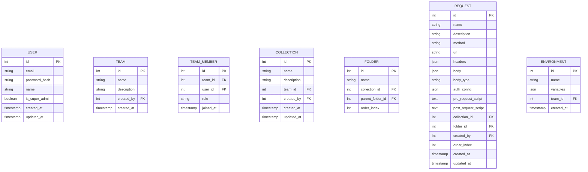
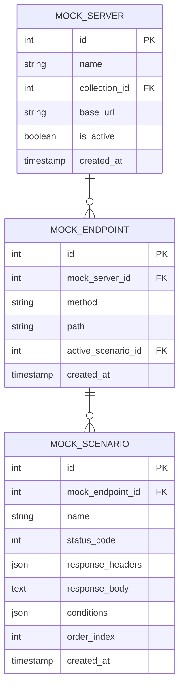

# Wapbolt — Product Requirements Document (PRD)

**Versi:** 1.5  
**Status:** Active Development  
**Terakhir Diperbarui:** April 2026  
**Author:** Waluyo Ade Prasetio

---

# Overview

**Wapbolt** adalah desktop application untuk pengujian, kolaborasi, dan dokumentasi API — alternatif Postman yang dirancang untuk tim developer dan QA.

Dibangun sebagai **Electron desktop app** (macOS + Windows), bebas CORS karena request dikirim dari Electron Main Process. Backend **Go single binary** berjalan di STB Android Waluyo (via Cloudflare), dan kelak bisa diinstall **on-premise di server client** tanpa perubahan kode.

**Status saat ini:** Fase 1-5 selesai. Fase 6 (UX & Power Features) sedang direncanakan.

---

# Nama & Branding

| Atribut | Detail |
|---|---|
| **Nama Produk** | Wapbolt |
| **Asal Nama** | Inisial **W**aluyo **A**de **P**rasetio + suffix *-ify* |
| **Tagline** | *"API Testing, Built for Teams"* |
| **Domain** | wapbolt.io / wapbolt.dev |
| **Backend URL (internal)** | api.wapbolt.io (via Cloudflare Tunnel → STB Android) |

---

# Infrastruktur

```
Tim (mana saja, internet)
        │
        ▼
┌───────────────────┐
│  Cloudflare       │  ← HTTPS otomatis, DDoS protection, IP rumah tersembunyi
│  api.wapbolt.io    │
└────────┬──────────┘
         │ Cloudflare Tunnel
         ▼
┌───────────────────┐
│  STB Android      │  ← Di rumah Waluyo
│  Go Backend       │
│  + PostgreSQL     │
└───────────────────┘
```

---

# Model Akses & Tim

## Super Admin (Waluyo)
- `is_super_admin = true` — akses semua tim tanpa perlu diundang
- Buat tim, assign member, suspend/hapus akun, reset password
- Tidak ada self-register — semua akun dibuat Waluyo

## Workspace & Tim

```
Waluyo (Super Admin)
├── Workspace: "Backend Team"
│   ├── Member: Budi (Editor), Siti (Viewer)
│   └── Koleksi: "Payment API", "User API"
├── Workspace: "Mobile Team"
│   ├── Member: Andi (Editor), Rina (Admin)
│   └── Koleksi: "Mobile API", "Push Notif"
└── Workspace: "QA Team"
    ├── Member: Dodi (Viewer)
    └── Koleksi: "Regression Suite"
```

**Catatan:** Istilah "Tim" diubah menjadi **"Workspace"** mulai Fase 6 agar konsisten dengan terminologi industri (Postman, Insomnia). Data model di backend tetap sama (`TEAM` table), hanya label UI yang berubah.

## Role Per Workspace

| Role | Hak Akses |
|---|---|
| **Owner** | Semua + delete workspace + manage member |
| **Admin** | Invite/remove member, manage collections & environments |
| **Editor** | Buat, edit, delete request & collection, drag-and-drop request |
| **Viewer** | Lihat dan kirim request, tidak bisa edit |

---

# Roadmap

```
✅ Fase 0-5 Selesai     →   Fase 6 (Sekarang)      →   Fase 7+
──────────────────          ──────────────────          ──────────────
Setup, MVP, Kolaborasi      UX & Power Features         On-Premise License,
Docs, Testing,              Workspace, Body types,      SaaS (opsional)
On-Premise License          Export code, cURL import,
                            Drag-drop, Mock dynamic
```

**Fitur Coming Soon (Fase 6+):**
Untuk menjaga fokus pada stabilitas fitur utama, beberapa elemen UI berikut diarahkan ke modal "Coming Soon":
- **Documentation Viewer (Integrated):** Penampil dokumentasi langsung di tab utama.
- **Cookie Manager:** Sinkronisasi dan isolasi cookie per workspace.
- **Advanced Send Options:** Dropdown menu pada tombol Send untuk fungsi tambahan.
- **Request Sharing:** Berbagi request via link publik atau internal.

---

# Fitur Lengkap

## ✅ Sudah Ada (Fase 1-5)

- Auth & User Management (JWT, no self-register, super admin)
- Workspace/Team management dengan role
- CRUD Collection, Folder, Request
- Import Postman v2.1 JSON
- Environment variables dengan interpolasi `{{variable}}`
- Pre-request & Post-request script (JavaScript, Wapbolt SDK dengan alias `wap`/`pm`)
- Kirim request via Electron Main Process (bebas CORS)
- Response viewer (status, body pretty-print, headers, timing)
- Auth: Basic Auth, Bearer Token, API Key
- Real-time collaboration & field-level locking
- Versioning & rollback
- Mock server (basic)
- Collection Runner & CLI (`wapbolt run`)
- On-premise license (Ed25519)

## 🚧 Fase 6 — UX & Power Features (Sekarang)

### 1. Workspace (Rename dari "Tim")
Perubahan terminologi UI dari "Tim" menjadi "Workspace" agar familiar bagi pengguna Postman. Backend tidak berubah.

### 2. Default Header `Content-Type: application/json`
Setiap request baru otomatis memiliki header `Content-Type: application/json` sebagai default. User bisa hapus atau ganti jika diperlukan.

### 3. Body Types Lengkap
Request body mendukung pilihan tipe berikut (dropdown selector):

| Tipe | Keterangan |
|---|---|
| **none** | Tidak ada body |
| **form-data** | `multipart/form-data` — key-value pairs, support file upload |
| **x-www-form-urlencoded** | Form URL encoded — key-value pairs, no file |
| **raw (JSON)** | Body JSON dengan Monaco Editor + syntax highlighting |
| **raw (Text)** | Plain text |
| **raw (XML)** | XML dengan syntax highlighting |
| **raw (HTML)** | HTML dengan syntax highlighting |
| **binary** | Upload file langsung sebagai body |

**Prioritas implementasi:** `none` → `form-data` → `x-www-form-urlencoded` → `raw (JSON)` (sudah ada) → sisanya menyusul.

Header `Content-Type` otomatis berubah sesuai pilihan tipe body:
- `form-data` → `multipart/form-data`
- `x-www-form-urlencoded` → `application/x-www-form-urlencoded`
- `raw (JSON)` → `application/json`
- `raw (XML)` → `application/xml`

### 4. Export Request ke Code Snippet

Dari setiap request, user bisa generate code snippet siap pakai dalam berbagai bahasa/tool:

| Target | Detail |
|---|---|
| **cURL** | Command line curl lengkap dengan headers & body |
| **JavaScript (Fetch)** | Native fetch API |
| **JavaScript (Axios)** | axios request |
| **Go** | `net/http` standard library |
| **Python (requests)** | `requests` library |
| **PHP (cURL)** | PHP curl_exec |
| **Java (OkHttp)** | OkHttp client |
| **Kotlin** | OkHttp atau Ktor |
| **Swift** | URLSession |
| **Dart** | `http` package (Flutter) |

UI: tombol `</>` di sebelah tombol Send → dropdown pilih bahasa → tampil modal dengan code snippet + tombol copy.

Variabel environment yang aktif di-resolve dulu sebelum di-generate (misal `{{base_url}}` diganti nilainya).

### 5. Import dari cURL

User bisa paste cURL command ke Wapbolt dan otomatis dikonversi menjadi request:

```bash
# Input (paste ke Wapbolt):
curl -X POST https://api.example.com/users \
  -H "Authorization: Bearer token123" \
  -H "Content-Type: application/json" \
  -d '{"name": "Budi", "email": "budi@example.com"}'

# Output (otomatis terisi):
# Method: POST
# URL: https://api.example.com/users
# Headers: Authorization: Bearer token123, Content-Type: application/json
# Body (JSON): {"name": "Budi", "email": "budi@example.com"}
```

UI: tombol "Import cURL" di toolbar atau deteksi otomatis saat user paste teks yang dimulai dengan `curl ` di field URL.

Parser harus support flag cURL umum: `-X`, `-H`, `-d`, `--data`, `--data-raw`, `-u` (basic auth), `--header`, `-b` (cookie).

### 6. Drag-and-Drop Request & Folder

User bisa memindahkan request dan folder hanya dengan drag-and-drop di sidebar:

**Yang bisa di-drag:**
- Request → ke folder lain dalam koleksi yang sama
- Request → ke root koleksi (keluar dari folder)
- Request → ke koleksi lain dalam workspace yang sama
- Folder → ke posisi berbeda dalam koleksi yang sama
- Folder → menjadi sub-folder dari folder lain

**Behaviour:**
- Visual indicator saat drag: garis biru menunjukkan posisi drop target
- Urutan (`order_index`) di-update ke backend setelah drop
- Undo dengan `Cmd+Z` / `Ctrl+Z` jika salah drop
- Role check: hanya Editor ke atas yang bisa drag-and-drop

### 7. Mock Server — Dynamic Response

Upgrade mock server dari static response menjadi mendukung **conditional / dynamic response** berdasarkan konten request yang masuk.

**Kondisi yang bisa dikonfigurasi:**

| Kondisi | Contoh |
|---|---|
| Query parameter | `?status=active` → response A, `?status=inactive` → response B |
| Request body field | `body.role == "admin"` → response A, selainnya → response B |
| Request header | `X-Version: v2` → response baru, default → response lama |
| Path parameter | `/users/123` → user data, `/users/999` → 404 |
| HTTP method | `GET` → list, `POST` → created |

**Switch Response (Manual):**
User bisa toggle secara manual response mana yang aktif dari UI — berguna untuk simulasi skenario sukses/gagal/loading tanpa harus ubah config.

**Response Scenarios per Endpoint:**
Setiap endpoint mock bisa punya beberapa "scenario" bernama:
- `200 Success`
- `400 Validation Error`
- `401 Unauthorized`
- `500 Server Error`

User bisa aktifkan scenario yang mau disimulasikan kapan saja.

---

# Database Schema

## Existing (Fase 1-5)



**Perubahan schema di Fase 6:**
- `REQUEST.body_type` — tambah kolom baru: `none` | `form-data` | `x-www-form-urlencoded` | `raw-json` | `raw-text` | `raw-xml` | `raw-html` | `binary`
- `REQUEST.body` — sekarang bisa berisi array of `{ key, value, enabled }` untuk form-data dan urlencoded

## Tambahan Fase 6 — Mock Server Dynamic



**Penjelasan:**
- `MOCK_ENDPOINT` — satu endpoint mock (misal: `POST /users`)
- `MOCK_SCENARIO` — satu kemungkinan response (misal: "200 Success", "400 Error")
- `MOCK_ENDPOINT.active_scenario_id` — scenario mana yang aktif saat ini (bisa di-switch manual)
- `MOCK_SCENARIO.conditions` — array kondisi JSON untuk dynamic matching:
  ```json
  [
    { "source": "query", "key": "status", "operator": "eq", "value": "active" },
    { "source": "body", "key": "role", "operator": "eq", "value": "admin" }
  ]
  ```

---

# Tech Stack

## Desktop (Electron + React)

| Teknologi | Pilihan |
|---|---|
| Framework | **Electron** |
| UI | **React + Zustand + Radix UI + Tailwind CSS** |
| Code Editor | **Monaco Editor** (request body & scripts) |
| Drag and Drop | **@dnd-kit/core + @dnd-kit/sortable** |
| cURL Parser | **curlconverter** (npm) |
| Code Generator | Custom per bahasa (template-based) |
| Scripting Libraries | **Moment.js, Lodash** |
| HTTP Executor | **Electron Main Process** (bebas CORS) |
| Credential Storage | **keytar** (OS keychain) |
| Packaging | **electron-builder** (.dmg + .exe) |
| Auto Update | **electron-updater** |

## Backend (Go — STB Android)

| Teknologi | Pilihan |
|---|---|
| Language | **Go** |
| Framework | **Fiber** |
| ORM | **GORM** |
| Database | **PostgreSQL** |
| Auth | **JWT + Refresh Token Rotation** |
| Migrations | **golang-migrate** |
| Logging | **zerolog** |
| Email | **Resend** (resend-go SDK) |

---

# Technical Constraints & Guidelines

- **CORS:** Request ke target API wajib dari Electron Main Process, bukan Renderer.
- **No Self-Register:** Akun dibuat via `wapbolt-admin create-user`.
- **Super Admin:** `is_super_admin = true` bypass semua role check.
- **body_type Migration:** Migration tambah kolom `body_type` ke tabel REQUEST dengan default `raw-json` agar tidak breaking existing data.
- **cURL Import:** Parser harus toleran terhadap variasi format cURL (multiline dengan `\`, single line, dengan/tanpa quotes).
- **Code Snippet:** Environment variable di-resolve menggunakan active environment sebelum generate snippet. Jika variable tidak ada nilainya, tampilkan placeholder `{{variable_name}}`.
- **Drag-and-Drop:** `order_index` di-update via PATCH endpoint setelah drop selesai. Gunakan fractional indexing untuk menghindari re-numbering seluruh list.
- **Mock Condition Matching:** Evaluasi kondisi dari atas ke bawah, scenario pertama yang match digunakan. Jika tidak ada yang match, gunakan `active_scenario_id`.
- **Cloudflare:** Backend hanya bind `localhost`.
- **Migrations:** Wajib golang-migrate, tidak boleh manual.
- **API Prefix:** `/api/v1/`.
- **Error Format:** `{ "error": "string", "code": "string", "details": {} }`.
- **On-Premise Ready:** Semua config via `.env`.
